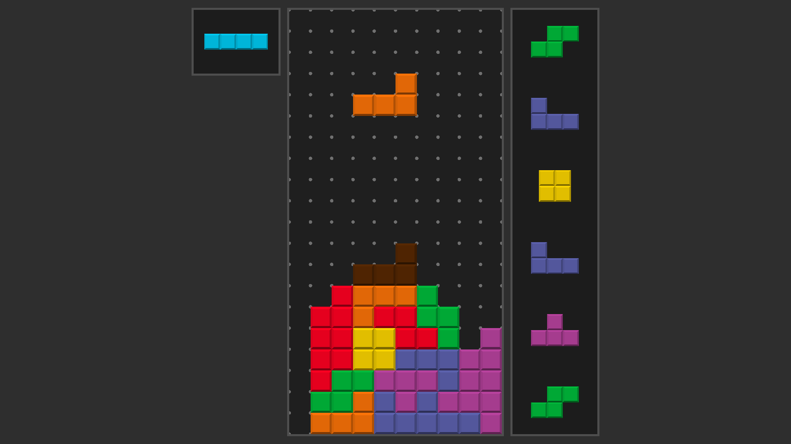

# Tetris clone

Simple Tetris implementation in C and OpenGL.



## Features

- Fixed goal marathon mode
- Delayed autoshift
- 7-bag randomization
- SRS rotation system with wall kick
- Hardware accelerated graphics
- WebAssembly + WebGL support

## Controls

| Key              | Action                   |
| ---------------- | ------------------------ |
| Left/Right arrow | Slide Left/Right         |
| Up arrow         | Rotate Clockwise         |
| Down arrow       | Soft drop                |
| Space            | Hard drop                |
| Z                | Rotate Counter-Clockwise |
| C                | Hold                     |
| R                | Start new game           |

## Todo

- T-spin detection
- Scoring system
- Font rendering for UI
- More visual feedback (particle system, screen shake)
- SFX

## Usage

### Requirements

**Linux build**

- A C99 compiler
- GNU make
- GLFW
- GLEW

**WebAssembly build**

- Clang
- A web server (ex: `python -m http.server`)

**Windows build**

- `¯\_(ツ)_/¯`

### Building

Running this will compile both the Linux version and the web version

```
make
```

### Debugging

Compile with debug symbols then use gdb to debug

```
make debug

gdb ./debug/app
```

### Running

For the Linux version, the executable is located at `./build/app`

For the web version use a web server (See [above](#requirements)) to host the
website.

## License

This project is licensed under the [MIT License](LICENSE).
